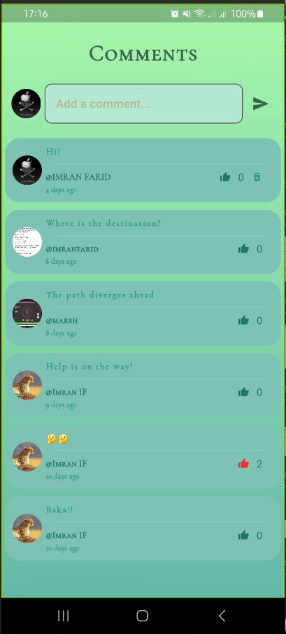

# <h1 align = "center"> Summarize It</h1>

<!-- + _Note: This mobile app was developed as part of the CSE-618 course of Computer Science and Engineering, University of Chittagong. -->

<div align="center">

[](https://img.shields.io/badge/stable_release-v1.0.0-blue)
[](https://visitor-badge.laobi.icu/badge?page_id=ImranIF.R_kgDOLHQ8kg&left_color=red&right_color=green)
[](https://img.shields.io/badge/license-MIT-blue)
[](https://play.google.com/store/apps/details?id=com.faridimran.summarize_it)

</div>

_Summarize It_ is an AI text summarizer mobile application developed using Flutter framework and Firebase backend. With an incredibly intuitive user interface tailored for professionals, students and enthusiasts alike, this app aims to condense lengthy, verbose texts into concise summaries without any semantic tradeoffs. It also offers a robust post-sharing feature, device location tracker and many more.

 <!-- that streamlines the complex ... while offering . -->

## Table of Contents

- [Downloads](#downloads)
- [Getting Started](#getting-started)
- [Usage](#usage)
- [Features](#features)
- [Changelog](#changelog)
- [Contributors](#contributors)
- [Acknowledgement](#acknowledgement)

## Downloads

The mobile app is publicly available for downloading at [Google Play Store](https://play.google.com/store/apps/details?id=com.faridimran.summarize_it).

## Getting Started

The mobile app project has several branches, two of which: `main`, `development` and several other feature branches for building & testing features.

- `main` contains the aggregate code for stable release version with complete features
- `development` contains the aggregate code with possibly unreleased features which are undergoing iterative development & testing

If you want to start using the mobile app directly without making any technical modification, head over to the [usage section](#usage) instead.

### Installation

Before starting, make sure you already have Flutter and Dart installed on your local system. For details on how to do that, check the [official documentation](https://docs.flutter.dev/get-started/install).

<details>
<summary> Project Structure </summary>

An illustration of the project structure of the mobile application is provided as follows:

```
	summarize_it
	├── .dart_tool
	├── .idea
    ├── android
    ├── assets
    ├── build
	├── media
    .
    .
	└── lib
		├── authentication
        │   ├── auth_page.dart
        │   ├── auth_service.dart
        │   ├── loginpage.dart
        │   └── registerpage.dart
		├── components
        │   ├── custombutton.dart
        │   ├── customtextfield.dart
        │   ├── pdfapi.dart
        │   ├── sessionmanager.dart
        │   └── textbox.dart
		├── models
        │   ├── textsummarizationmodel.dart
        │   └── usermodel.dart
		├── pages
        │   ├── aboutus.dart
        │   ├── graphql.dart
        │   ├── help.dart
        │   ├── homepage.dart
        │   ├── pdfviewerpage.dart
        │   ├── postlist.dart
        │   ├── postscreen.dart
        │   ├── profile.dart
        │   ├── rating.dart
        │   ├── report.dart
        │   └── summarizer.dart
		├── provider
        │   └── userprovider.dart
		├── sass
        │   └── aboutus.scss
        ├── screen
        │   ├── commentscreen.dart
        │   ├── homescreen.dart
        │   └── splashscreen.dart
		└── firebase_options.dart
		└── main.dart
```

</details>

## Usage

Ensure that your mobile device specifications meet the minimum requirements first. Once that is confirmed, download the apk file and install it into your mobile device.

### Requirements

#### Android specifications

Minimum [SDK/API level 23](https://apilevels.com/) required. Android 5.0+ devices supported officially.

#### iOS specifications

TBA

## Features

<details>
<summary> User Authentication </summary> 
<div align="center">

|             **Login**              |                 **Registration**                 |                **Email Verification**                 |
| :--------------------------------: | :----------------------------------------------: | :---------------------------------------------------: |
|  |  |  |

</div>
</details>
<details>
<summary> Profile System </summary> 
<div align="center">

|             **User Profile**              |             **Location Tracker**              |               **Session Manager**               |
| :---------------------------------------: | :-------------------------------------------: | :---------------------------------------------: |
|  |  |  |

</div>
</details>
<details>
<summary> Summarize Engine </summary>
<div align="center">

|              **Text Summarizer**              |               **Help**                |
| :-------------------------------------------: | :-----------------------------------: |
|  |  |
|                     <!--                      |  <kbd></kbd>   |

</div>
</details>
<details>
<summary> Post Management </summary>
<div align="center">

|             **Create Posts**              |            **Post List**            |              **Comment**               |
| :---------------------------------------: | :---------------------------------: | :------------------------------------: |
|  |  |  |

</div>
</details>

## Changelog

<details>
<summary> v1.0.0 </summary>
- Initial Launch
<summary> v1.0.7 </summary>
- Migrated to Supabase
</details>

## Contributors

## Acknowledgement

_Summarize It_ uses the pre-trained [BART model](https://github.com/facebookresearch/fairseq/tree/main/examples/bart) fine-tuned on CNN daily mail and credit goes to them for allowing free usage.
